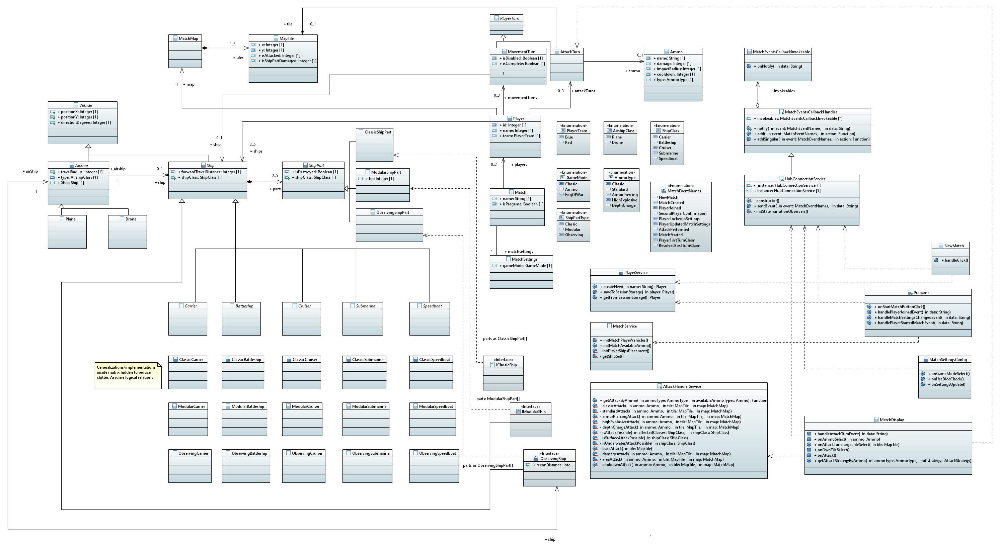

# Battleships
An implementation of the classic battleships game with added features such as a gamemode with various ammo types of different functionality.

## Comms
Communication between players is mediated by the backend server (BE), while users play the game in the frontend (FE). Actions performed by the players get propagated to all users via SignalR, individual FE clients react to the received events and update the local game state accordingly

FE sends information about the players actions to BE via a SignalR hub connection, where and event with an id and data is sent to the BE. BE than propagates the event to all FE clients connected to the BE SignalR hub.

Event propagation steps:
1. Client_1 sends event E to Server
1. Server received E
1. Server sends E to Client_1, Client_2
1. Client_i receives E
1. Client_i resolves callbacks associated with id of E and invokes them by passing the data sent together with E

## Display
FE is implemented using React. Different game stages have React components to render them (NewMatch, Pregame, MatchDisplay).

*NewMatch* - Initial game view. Player can select a name and join a match.

*Pregame* - Upon joining a match, player is navigated to the *Pregame* view where he awaits the other player to join. When both players have joined, the match settings can be configured and locked in to start the match.

*MatchDisplay* - The main view of the match. Players can see the game map as well as information about the players and the units they control. Players take turns in selecting a tile from the enemy's map grid and perform attacks and other game actions.

## Game logic

Game follows the classic battleships game rules with some extra features added, such as having a game mode where the classic single-hit-sink attack is replaced by a set of different possible ammo types that each have a number of characteristics separating them. Alongside that, the individual ship parts have health points (10 by default) and the part gets sinked only if its HP reaches 0. The game mode also makes the different ammo types effective only on certain ship types - a *Submarine* can only be hit by the *Depth charge* ammo type, while this ammo is not effective on other ship types. The available ammo types in this game mode are:

*Standard* - similar to the ammo in classic mode, however here it does 3 damage instead,

*Armor piercing* - a powerful attack that deals 10 damage in a single map tile, however it adds cooldown to the players actions, which make it consume more than one turn,

*High explosive* - an attack spanning over multiple map tiles (3x3 grid) and dealing small damage in each of the affected tiles,

*Depth charge* - an area of effect attack (3x3 grid) that is the only ammo type effective on the *Submarine* ship type. It deals larger damage in each of the affected tiles compared to *High explosive* ammo.

Another game mode that differs from the classic rules is the *Fog of war* game mode where players can only attack enemy map tiles in the area that is *illuminated* by their own ships. Each ship type has an associated recon distance that determines its *illumination* range. Ships also have an *AirShip* that they can deploy on each turn to *illuminate* a small area outside of their recon range. The *Carrier* ship class has a *Plane* type *AirShip* that has a long range, while other ship types have a *Drone* that can be deployed only a short distance from the ship.

## Class descriptions

**Display components classes**: *NewMatch, Pregame, MatchSettingsConfig, MatchDisplay*

**Model classes**:

- *Match* - match model's class, stores the current match state, defines props for match settings, players, match name and flag for whether match is in the pregame state

  - *MatchSettings* - match settings' model class, defines props for values of settings for the game mode

- *Vehicle* - base game unit class. Has props for positioning. Abstract

  - *Ship* - base ship unit class. Has props for ship class, ship parts collection and forward travel distance. Abstract

    - *Carrier*, *Battleship*, *Cruiser*, *Submarine*, *Speedboat* - classes for ship types. Abstract

      - *Classic** - concrete ship unit classes for classic ships
      
      - *Modular** - concrete ship unit classes for modular ships (*Ammo* game mode)

      - *Observing** - concrete ship unit classes for observing ships (*Fog of war* game mode)

- *AirShip* - base air ship unit class. Has props for travel radius, type and the parent ship's reference. Abstract

  - *Plane* - concrete air ship unit class

  - *Drone* - concrete air ship unit class

- *ShipPart* - base ship part class, has props for parent ship's class and flag if it's destroyed. Abstract

  - *ClassicShipPart* - concrete ship part class for classic type ships

  - *ModularShipPart* - concrete ship part class for modular type ships, has props for part's health point count

  - *ObservingShipPart* - concrete ship part class for observing type ships

- *IClassicShip*, *IModularShip*, *IObservingShip* - interfaces for ship types

- *Player* - player model class

- *PlayerTurn* - class for player turns. Abstract

  - *AttackTurn* - concrete class for player's attack turns, defines props for the tile and ammo for the attack

  - *MovementTurn* - concreate class for player's movement turns, defines props for the selected ship and flags for whether the turn is disabled and complete

- *Ammo* - class for ammo model, defines props for ammo name, damage, impact radius, coodown and type

**Service classes**

- *HubConnectionService* - service handles the SignalR connections and event sending

- *MatchService* - service defines various methods to initialize the models required for a new match 

- *AttachHandlerService* - service defines methods for resolving the appropriate function to perform an attack based on the given ammo type

- *PlayerService* - service defines methods new player creation as well as player object saving and fetching via session storage

- *MatchEventsCallbackHandler* - class is responsible for handling received events

- *MatchEventsCallbackInvokeable* - class is used by *MatchEventsCallbackHandler* to organize the event handlers

## Quickstart guide

**Prerequisites**: Node, pnpm, .NET 8

### Frontend

1. Navigate to `src/battleships-ui`
1. Run `pnpm i`
1. Run `pnpm start`
1. Wait for a browser window with the client app to open

### Backend

1. Navigate to `src/battleships-api`
1. Run `dotnet run`
1. Wait for the program to compile and start

